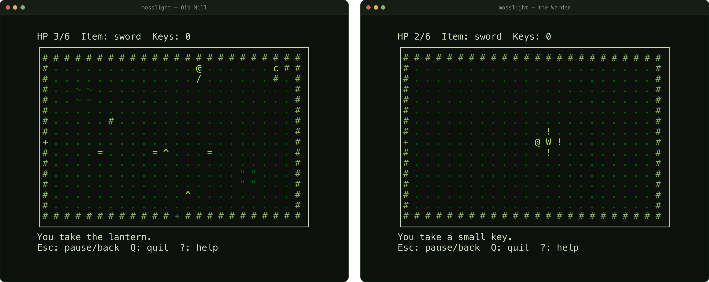

# Mosslight



*Real frames, 60x24, default `--theme gameboy` with the ASCII glyph set.*

A single-player, top-down terminal adventure. The forest lighthouse has gone dark; find the
ancient ember in the flooded sanctuary and relight it. Runs locally and over an interactive SSH
session with a PTY. macOS and Linux only.

## Install

There is no published release artifact — build from source. You need the Rust toolchain
(`rustup`); `rust-toolchain.toml` pins 1.98.1 and `rustup` selects it automatically.

```sh
git clone https://github.com/korkholeh/mosslight
cd mosslight
cargo build --release --locked
```

The binary is then `./target/release/mosslight`. To put it on your `PATH` instead:

```sh
cargo install --path . --locked
```

`Cargo.lock` is committed and every command passes `--locked`.

## Run

```sh
cargo run --release
./target/release/mosslight --ascii --color never --fps 10
./target/release/mosslight --theme mono --save-dir /tmp/mosslight-scratch
```

(Write `mosslight` in place of `./target/release/mosslight` if you ran `cargo install`.)

The game refuses to start without an interactive terminal (stdin and stdout must both be a TTY,
and `TERM` must not be unset or `dumb`) and exits with a one-line explanation before touching raw
mode. When testing by hand, pass `--save-dir` to a scratch directory so a manual run cannot
overwrite a real save.

Start here if you are playing rather than hacking: **`docs/user/README.md`** — it walks the pages in
order (CLI reference, key map, SSH/tmux).

## Controls

| Action | Keys |
|---|---|
| Move | Arrows or WASD |
| Attack | J or Space |
| Lantern | K |
| Interact / confirm | E or Enter |
| Map | M |
| Inventory | I |
| Pause / back | Esc |
| Help | ? |
| Quit (with confirmation) | Q |

No key-release events, chords, or extended keyboard protocols are ever used, so the game is fully
playable over a plain SSH session — single key presses only.

## Running over SSH

```sh
ssh -t user@host 'mosslight --ascii --fps 10'
```

The `-t` flag forces a PTY, which the game requires. Everything runs on the remote host; SSH only
carries keystrokes and terminal output. If the connection should survive a dropped SSH session,
start the game inside `tmux` or `screen` on the remote host first. Full detail — `--fps` on a slow
link, `TERM` and 256-colour behaviour inside tmux, and what was and was not actually measured or
tested — is in `docs/user/ssh.md`.

## If the terminal looks broken after a crash

The game restores raw mode, the alternate screen, the cursor and text styles on every exit path,
including a panic. If something still looks wrong (e.g. after a killed process), run:

```sh
reset
```

## Development

```sh
cargo fmt --check && cargo clippy --all-targets --all-features -- -D warnings && cargo test --locked
```

This is the gate every phase must pass; CI (`.github/workflows/ci.yml`) runs it on
`ubuntu-latest` and `macos-latest`. See `docs/dev/development.md` for setup/build/debug,
`docs/dev/testing.md` for the test layers, `docs/dev/loop-and-modes.md` for the loop and
mode-machine architecture, `docs/dev/architecture.md` for a full summary of the module map, the
pure-core boundary, the tick model, the run-length model and where the build diverged from the
original design, `docs/dev/content.md` for the RON schema and the validator's checks,
`docs/dev/troubleshooting.md` for symptom-to-fix, `docs/dev/verification-report.md` for what was
actually checked and how, and `.autodev/ARCHITECTURE.md` for the original design rationale.

`scripts/terminal-restore-check.sh` drives a real PTY (via `expect`) through the normal-exit,
`--debug-panic`, and live-resize paths and prints `stty -a` before/after each, for manually
confirming terminal restoration on a given host; see `docs/dev/troubleshooting.md` if it hangs or
misbehaves in a sandboxed environment.

See `CHANGELOG.md` for user-visible changes.

## Shipped state (0.1.0)

The game is completable end to end and saves progress: New Game through the nine-room overworld
(sword, lantern, three NPCs, chests, four secrets including two heart containers, a step-plate
puzzle), into the six-room dungeon behind the marsh's lantern-locked door (two small keys, a
block-on-plates puzzle, a torch-sequence puzzle, guardians), through a two-phase telegraphed boss,
and back to the lighthouse's beacon to relight it and win. An itemised estimator
(`src/game/balance.rs`, `tests/balance.rs`) ties the target 30-45 minute first playthrough to the
tuned content and simulation constants rather than leaving it an untested intention — the tuned
world lands at roughly 33 minutes. Progress persists in one save slot, written automatically at
four points plus a manual save from the pause screen; `gameboy`, `ansi` and `mono` are three real,
visually distinct palettes. `--unicode` has been withdrawn (see `docs/user/cli.md`) rather than
shipped half-populated.

Terminal output volume and CPU/RSS are both measured (≈30.5 KB/min during active play and exactly 0
bytes while paused; CPU near-zero in both the play and pause windows via `scripts/measure-cpu.sh`),
not just assumed. See `docs/dev/verification-report.md` for the numbers, the host they were measured
on, and — just as importantly — an explicit list of what was **not** verified (Linux and a real
networked SSH session are CI-only/untested here; the ~150 ms RTT playability check, Intel macOS and
aarch64 Linux were never reachable from this development host). `.autodev/HANDOFF.md` is the
briefing for whoever picks this up next — every check that ran, the decisions worth overruling, the
known gaps and the risks still open. Its headline: the run-length estimator's human-behaviour
parameters are a reasoned model, not a measurement, and nobody has played this game yet.
